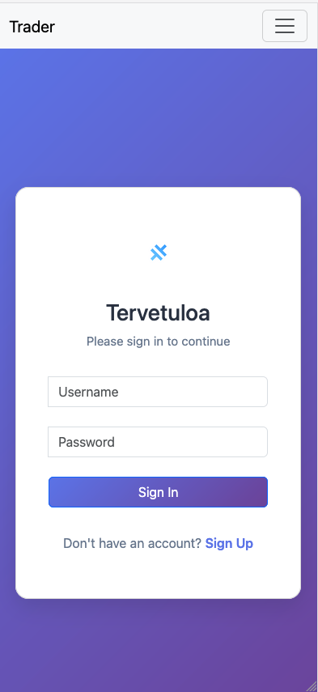
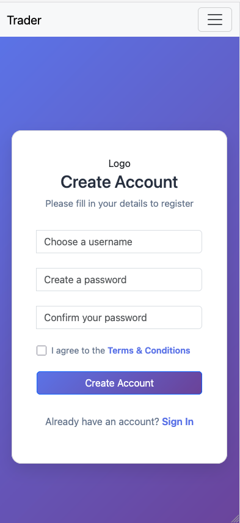
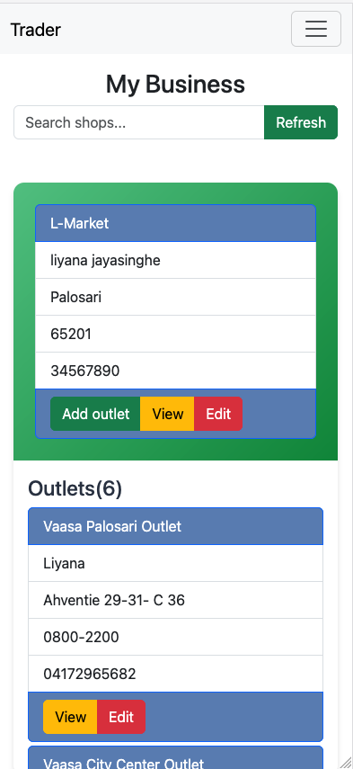
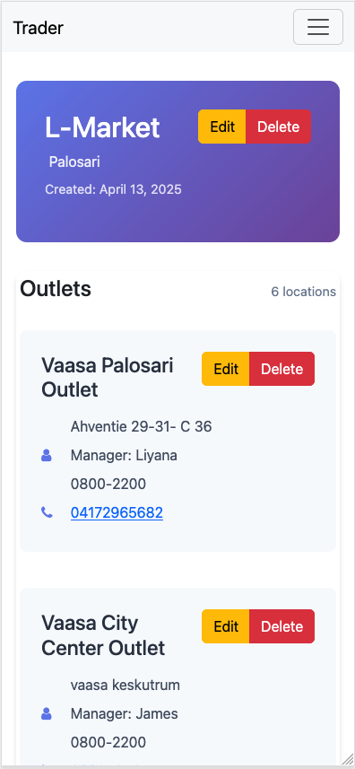
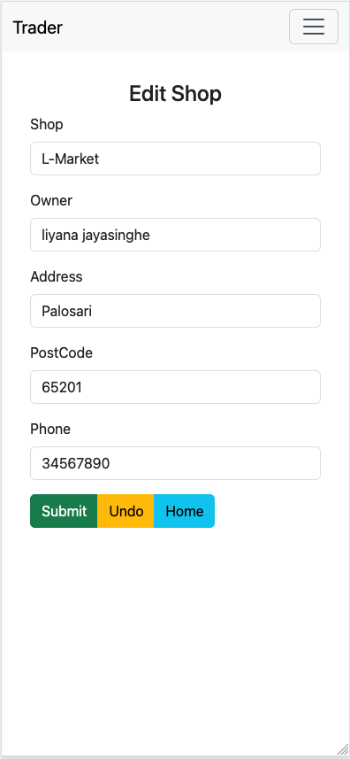
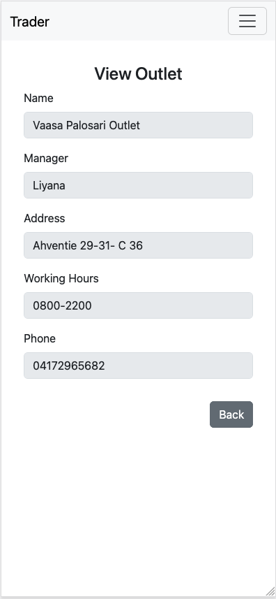
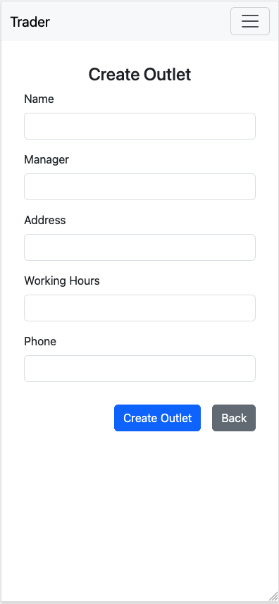

## Created with Capacitor Create App

This app was created using [`@capacitor/create-app`](https://github.com/ionic-team/create-capacitor-app),
and comes with a very minimal shell for building an app.UI/UX build with Twitter Bootstrap 5.3

### Running Trader App

To install & build the project using bellow commands.Finally run using last commands.

```bash
$ npm install
$ npx cap add android
$ npm run build
$ npx cap sync
$ npm run start --  --host
Run mobile app
$ npx can run android
```
Login

Register

Home

Shop- In detail

Shop Update

Outlet - In detail

Outlet - create

